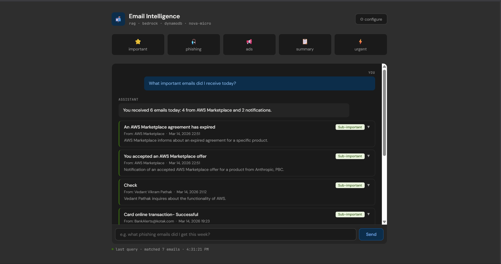

# Email Intelligence Pipeline

A serverless email intelligence system that automatically ingests, classifies, and enables natural language querying of your Gmail inbox using AWS Bedrock, DynamoDB, and S3.

## Architecture

```
Gmail Inbox
    ↓ (IMAP polling — EventBridge every 1 hour)
email-poller Lambda
    ↓ (POST /ingest-email)
API Gateway
    ↓
email-ingest Lambda
    ├── Amazon Nova Micro → classify + summarize
    ├── Titan Embeddings → vector embedding
    ├── S3 → store raw email JSON
    └── DynamoDB → store metadata + embedding

User Query (Web Dashboard)
    ↓ (POST /query)
API Gateway
    ↓
email-query Lambda
    ├── Time + classification filtering
    ├── Cosine similarity ranking
    ├── Amazon Nova Lite → generate answer
    └── /expand route → fetch full email body from S3
```

## Features

- **Auto-classification** — important, sub-important, advertisement, phishing
- **Natural language queries** — "any urgent emails today?", "show me mail from Glassdoor"
- **Click-to-expand** — full email body loaded on demand from S3
- **Deduplication** — Message-ID tracking prevents re-ingestion
- **Time-aware** — "last 3 days", "this week", "yesterday" all work
- **Sender search** — finds emails by sender name mentioned in query
- **Prompt injection protection** — email content wrapped in triple quotes

## AWS Services Used

| Service | Purpose |
|---|---|
| Lambda | email-ingest, email-query, email-poller, email-cleanup |
| API Gateway | HTTP API with /ingest-email, /query, /expand routes |
| DynamoDB | EmailStore (metadata + embeddings), IngestedMessageIds (dedup), ChatHistory |
| S3 | Raw email archive + static dashboard hosting |
| EventBridge | Hourly poller trigger, monthly cleanup trigger |
| Bedrock (Nova Micro) | Email classification + summarization |
| Bedrock (Nova Lite) | RAG query answering |
| Bedrock (Titan Embeddings V2) | Vector embeddings for semantic search |

## Setup

### 1. Prerequisites

- AWS account with Bedrock access (Nova Micro, Nova Lite, Titan Embeddings V2)
- Gmail account with IMAP enabled
- Gmail App Password (myaccount.google.com/apppasswords)

### 2. DynamoDB Tables

```bash
# Main email store
aws dynamodb create-table \
  --table-name EmailStore \
  --attribute-definitions \
    AttributeName=email_id,AttributeType=S \
    AttributeName=classification,AttributeType=S \
    AttributeName=received_at,AttributeType=S \
  --key-schema AttributeName=email_id,KeyType=HASH \
  --billing-mode PAY_PER_REQUEST \
  --global-secondary-indexes '[{
    "IndexName": "classification-date-index",
    "KeySchema": [
      {"AttributeName":"classification","KeyType":"HASH"},
      {"AttributeName":"received_at","KeyType":"RANGE"}
    ],
    "Projection": {"ProjectionType":"ALL"}
  }]'

# Deduplication tracking
aws dynamodb create-table \
  --table-name IngestedMessageIds \
  --attribute-definitions AttributeName=message_id,AttributeType=S \
  --key-schema AttributeName=message_id,KeyType=HASH \
  --billing-mode PAY_PER_REQUEST

aws dynamodb update-time-to-live \
  --table-name IngestedMessageIds \
  --time-to-live-specification Enabled=true,AttributeName=ttl

# Chat history (optional)
aws dynamodb create-table \
  --table-name ChatHistory \
  --attribute-definitions AttributeName=session_id,AttributeType=S \
  --key-schema AttributeName=session_id,KeyType=HASH \
  --billing-mode PAY_PER_REQUEST

aws dynamodb update-time-to-live \
  --table-name ChatHistory \
  --time-to-live-specification Enabled=true,AttributeName=ttl
```

### 3. S3 Buckets

```bash
# Email archive (private)
aws s3 mb s3://your-email-archive-bucket

# Dashboard (public static website)
aws s3 mb s3://your-dashboard-bucket
```

### 4. IAM Role

Create `EmailPipelineLambdaRole` with permissions for:
- `bedrock:InvokeModel`
- `dynamodb:PutItem`, `dynamodb:Scan`, `dynamodb:GetItem`, `dynamodb:Query`
- `s3:PutObject`, `s3:GetObject`, `s3:DeleteObject`
- `logs:CreateLogGroup`, `logs:CreateLogStream`, `logs:PutLogEvents`

### 5. Lambda Functions

| File | Lambda Name | Runtime | Memory | Timeout |
|---|---|---|---|---|
| email_ingest.py | email-ingest | Python 3.12 | 256MB | 45s |
| email_query.py | email-query | Python 3.12 | 256MB | 45s |
| email_poller.py | email-poller | Python 3.12 | 256MB | 5min |
| email_cleanup.py | email-cleanup | Python 3.12 | 256MB | 5min |

**Add the AWSSDKPandas-Python312 layer to `email-query`** (required for numpy).

### 6. Environment Variables

**email-ingest:**
```
DYNAMO_TABLE = EmailStore
S3_BUCKET    = your-email-archive-bucket
API_SECRET   = your-secret-string
AWS_REGION   = us-east-1
```

**email-query:**
```
DYNAMO_TABLE = EmailStore
S3_BUCKET    = your-email-archive-bucket
API_SECRET   = your-secret-string
AWS_REGION   = us-east-1
```

**email-poller:**
```
GMAIL_ADDRESS      = your-gmail@gmail.com
GMAIL_APP_PASSWORD = your-16-char-app-password
API_URL            = https://YOUR_API_ID.execute-api.YOUR_REGION.amazonaws.com/ingest-email
API_SECRET         = your-secret-string
MSGID_TABLE        = IngestedMessageIds
AWS_REGION         = us-east-1
```

**email-cleanup:**
```
DYNAMO_TABLE    = EmailStore
S3_BUCKET       = your-email-archive-bucket
RETENTION_DAYS  = 90
```

### 7. API Gateway

Create an HTTP API with these routes:

| Method | Path | Lambda |
|---|---|---|
| POST | /ingest-email | email-ingest |
| POST | /query | email-query |
| POST | /expand | email-query |
| OPTIONS | /ingest-email | — |
| OPTIONS | /query | — |
| OPTIONS | /expand | — |

CORS configuration:
```
Access-Control-Allow-Origin:  *
Access-Control-Allow-Headers: content-type, x-api-secret
Access-Control-Allow-Methods: POST, OPTIONS
```

### 8. EventBridge Schedules

```bash
# Hourly email polling
# Rate: 1 hour → Target: email-poller Lambda

# Monthly cleanup
# Cron: 0 0 1 * ? * → Target: email-cleanup Lambda
```

### 9. Dashboard

Update `index.html` with your API Gateway URL and upload to your S3 static website bucket.

Open the dashboard → click ⚙ Configure → enter your API URL and secret.

### 10. Backfill Historical Emails

Edit `backfill.py` with your credentials and run locally:

```bash
pip install urllib3
python backfill.py
```

## Cost Estimate (Personal Use)

| Service | Monthly Cost |
|---|---|
| Lambda | ~$0 (free tier) |
| API Gateway | ~$0 (free tier) |
| DynamoDB | ~$0 (free tier) |
| S3 | ~$0.01 |
| Bedrock Nova Micro (classify) | ~$0.05 |
| Bedrock Nova Lite (query) | ~$0.10 |
| Bedrock Titan Embeddings | ~$0.10 |
| **Total** | **~$0.25–0.50/month** |

## Query Examples

```
"Any new emails today?"
"Show me phishing emails"
"Any mail from Glassdoor?"
"What important emails did I receive this week?"
"Any urgent emails I need to action on?"
"Show me the NSE email"
"Any ads from Amazon?"
"Emails from last 3 days"
```

## Project Structure

```
email-pipeline/
├── email_ingest.py    # Lambda: classify + embed + store
├── email_query.py     # Lambda: RAG query + /expand route
├── email_poller.py    # Lambda: Gmail IMAP polling
├── email_cleanup.py   # Lambda: 90-day retention cleanup
├── backfill.py        # Local script: historical email ingestion
├── index.html         # Web dashboard
└── README.md
```

## Security Notes

- API protected by `x-api-secret` header (case-insensitive)
- Email bodies stored in private S3, never exposed directly
- Full body only loaded on explicit user click (/expand)
- Prompt injection mitigation: email content wrapped in triple quotes
- Never commit your API secret, Gmail app password, or AWS credentials

## Example
-## Interface Preview


